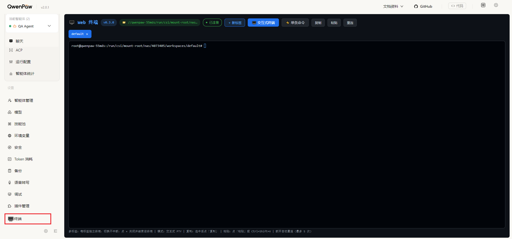

# 🖥️ Web 终端 (qwenpaw-web-terminal) v0.1.4

浏览器终端窗口插件：多标签（每标签独立 PTY，关闭标签即结束终端）+ 会话持久化（刷新/断网后台保留，可重新 attach 并回放输出）+ 会话管理面板（查看/打开/结束/清理，同名新建自动打开）+ xterm.js 渲染（ANSI/光标/Tab 补全/复制粘贴）+ 单条命令执行（exec）+ WebSocket 交互式 PTY + 多会话 + 自动重连 + 惰性连接。采用 [Apache License 2.0](LICENSE) 许可协议发布。

> 由第三方扫雷插件（minesweeper-game）的 app 插件骨架改造而来

## 功能（v0.1.2）

- **多标签**：每个标签一个独立交互式终端（独立 xterm + 独立 WS + 独立 bash PTY）；
  切换标签不中断终端，点击标签上的 × 关闭标签即结束该终端（前端显式 DELETE + 后端 killpg 回收进程）
- **会话持久化**：WS 意外断开（刷新页面/断网）**不再 kill PTY 进程**——终端转入后台保留，
  输出写入 4MB 历史缓冲；重新连接同会话自动 attach 原进程并回放完整历史。
  正常关闭标签（×）仍是「关闭即结束」，不会产生僵尸进程
- **会话管理面板**：标签栏「🗂 会话管理」按钮弹出管理面板，列出全部会话：
  状态徽标（● 前台运行 / ○ 前台空闲 / ◉ 后台运行·缓冲 N KB / 空闲）、PID、最后活动、cwd，
  支持**打开**（不在前台则转入前台）、**结束**（结束进程、保留会话）、**删除**（会话+进程）、
  **结束并删除所有后台会话**（一键清理不在前台标签栏的运行中会话：结束进程并删除会话）、**打开所有会话**（一键转入前台）、
  **新建会话**；会话 id 前 📌 标记「前台已打开」的会话
- **默认标签与智能体同名**：进入终端页自动创建一个与当前智能体同名的默认标签，
  惰性连接（不自动创建 bash 进程，仅输入/点重连触发）；若该默认会话已在后台运行
  （刷新/断网后）则改为打开（attach 原进程，不重复创建）
- **刷新后只保留默认标签**：除自动创建的默认标签外，其他会话刷新后全部留在后台
  （进程保留、可回放输出），在管理面板查看/打开；同名新建自动打开现有会话
  （不重置 cwd、不重复创建）
- **心跳保活 + 死连接清理**：前端每 20s 发一次心跳，后端自动清理超过 60s 无消息的
  死连接（标签冻结/断网/页面强制销毁残留的「已连接」幽灵会话）
- **全量历史回放**：始终记录会话输出（上限 4MB，保留尾部），刷新/重连后终端恢复
  断点前内容（命令回显、输出、prompt），断开期间的新输出也一并回放；前端滚动缓冲 50000 行
- **惰性连接**：进入终端页/初始标签/新建标签**不自动连接**——不会默认创建 bash 进程；
  仅明确输入字符或点「重连」触发连接（打开后台已有会话视为「打开」，会 attach 原进程）；
  切换标签、刷新浏览器不触发连接。未连接时终端内显示灰色提示行，连接成功自动清除；
  输入触发连接时首字符不丢
- **xterm.js 渲染**：自托管 `ui/vendor/`（xterm.js 4.19 + fit addon），真正的终端渲染——
  ANSI 颜色/光标、`ls --color`、vim/top 不再乱码；支持 Tab 补全、Ctrl+C、复制/粘贴
- **交互式终端**：`WS /api/qwenpaw-web-terminal/ws`，Python `pty` + bash，支持 vim/top 等需要 TTY 的程序
- **单条命令**：`POST /api/qwenpaw-web-terminal/exec`，`sh -c` 执行，支持 `cd` 会话持久
- **多会话**：`GET/POST/DELETE /api/qwenpaw-web-terminal/sessions`，exec 与 PTY 按 `session_id` 隔离 cwd
- **实时 cwd**：PTY 内 `cd` 后，通过 OSC 7（`\x1b]7;file://host/path\x07`）自动上报，
  顶部目录徽标实时更新
- **窗口自适应**：监听浏览器 resize，自动 `fit` 并同步 PTY 窗口大小；
  根容器跟随 QwenPaw console 宿主面板高度（`height:100% + minHeight:0`），无页面级滚动条
- **自动重连**：WS 断开后 1.5s×N 自动重连（最多 5 次），可手动「重连」
- **心跳**：WS 支持 `\x00ping` -> `\x00pong`



## 接口

| 方法 | 路径 | 说明 |
|---|---|---|
| GET  | `/api/qwenpaw-web-terminal/status` | 插件状态、版本、cwd（支持 `?session_id=` 指定会话） |
| GET  | `/api/qwenpaw-web-terminal/sessions` | 会话列表（id + cwd + PTY 状态：运行/已连接/后台运行/缓冲大小） |
| POST | `/api/qwenpaw-web-terminal/sessions` | 创建会话 `{id, cwd?}` |
| POST | `/api/qwenpaw-web-terminal/sessions/{sid}/kill` | 结束该会话的 PTY 进程（保留会话状态，重连重新拉起） |
| DELETE | `/api/qwenpaw-web-terminal/sessions/{sid}` | 删除会话（并强制结束该会话活跃/后台 PTY） |
| POST | `/api/qwenpaw-web-terminal/exec` | `{cmd, session_id?, timeout?}` → `{ok, stdout, stderr, exit_code, cwd}` |
| WS   | `/api/qwenpaw-web-terminal/ws?session=default` | 交互式 PTY；文本帧即输入，`\x00resize:cols:rows` 调整窗口，`\x00ping` 心跳 |

> WS 生命周期（v0.1.0）：首次连接 spawn 新 bash；进程存活时再次连接直接 **attach**
> 原进程并回放完整历史；WS 断开（刷新/断网）进程保留后台运行，输出写入 4MB 历史缓冲。
> 正常结束请用「关闭标签」（DELETE）或管理面板「结束」。

> 注意：插件 HTTP 路由挂在 `/api` + prefix（registry 源码 `full_prefix = f"/api{normalized}"`），
> 不是 `/api/plugins/...`（那是插件管理路由，安装/卸载用）。
> 前端 vendor 资源经 `/api/plugins/qwenpaw-web-terminal/files/ui/vendor/*` 公开加载。

## 前端资源

```
ui/
├── index.js           # 前端入口（xterm.js 渲染 + 多标签 + 会话管理 + 惰性连接 + 自动重连）
└── vendor/
    ├── xterm.js       # xterm.js 4.19.0 (MIT)
    ├── xterm.css
    └── xterm-addon-fit.js
```

## 安装 / 升级

```bash
# 发布前校验（可选但建议）
qwenpaw plugin validate ./qwenpaw-web-terminal
# 安装 / 覆盖更新（QwenPaw 运行中走 API 热装，无需重启）
qwenpaw plugin install ./qwenpaw-web-terminal --force
```

> 注意：不要用 `uninstall` + `install` 两步走——`uninstall` 有交互确认
> （`click.confirm`），在脚本 / 非交互环境下会卡住，且旧版未卸载时
> `install` 会因 id 已存在而拒绝。`--force` 一步完成覆盖更新（rmtree
> 旧目录 → 复制新目录），非交互环境不卡。

刷新 QwenPaw 页面，侧边栏/设置菜单出现「🖥️ 终端」入口，点击进入 `/apps/qwenpaw-web-terminal`。
平台（platform.agentscope.io）部署：在插件管理页面上传 zip 即可。

## 目录结构

```
qwenpaw-web-terminal/
├── plugin.json   # 清单：type=app, entry backend+frontend, menu, meta.pawapp
├── plugin.py     # 后端：status / sessions / exec / WebSocket PTY
├── ui/index.js   # 前端：xterm.js 终端组件
└── ui/vendor/    # 自托管 xterm.js
```

## 变更记录

见 [CHANGELOG.md](CHANGELOG.md)。

## 安全警告

- exec 与 PTY 均以 **QwenPaw 进程身份执行宿主机 shell 命令**，属于高危能力。
- 仅建议在本地 / 可信内网使用；不要部署到公网平台，不要在生产环境开启。
- 无独立鉴权，控制台可见即可用。

## 已知限制

- 单条命令模式为「一次性执行」语义（`sh -c`），`cd` 由后端维护会话级 cwd；
  复合命令 `cd x && pwd` 在同一次调用内有效但不会持久化（单独 `cd x` 才会）。
- 会话持久化依赖后端进程存活：QwenPaw 主服务重启会清空会话与后台 PTY（shutdown 时统一回收），
  刷新页面不丢；历史缓冲上限 4MB，超出仅保留尾部。
- 同一会话同一时刻只保留一个活跃 WS 连接（新连接会踢掉旧连接）。
- 前端 vendor 走 `/api/plugins/{id}/files/...` 公开路由，无独立鉴权。
